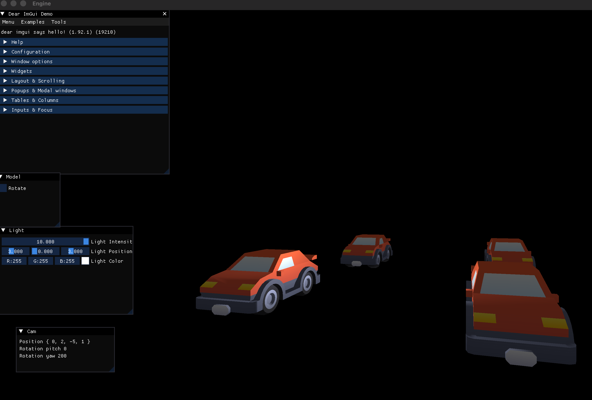

# ZigRendererTest
Small learning project loosely based on [@nadako](https://github.com/nadako)'s [great tutorial series](https://www.youtube.com/watch?v=tfc3vschDVw&list=PLI3kBEQ3yd-CbQfRchF70BPLF9G1HEzhy) translated into Zig 0.16 using [Slang](https://shader-slang.org/).

